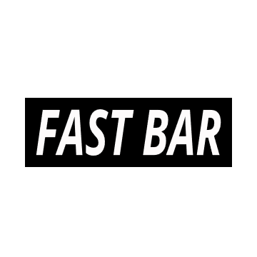

## OFERTA DE PRODUCTO O SERVICIO
Un sitio web con el menu de tragos de un boliche / bar, que nos permita ver la carta, pagar en el momento y nos avise cuando esta nuestro trago para retirar en la barra.

## LINKS

WIREFRAME
    https://www.figma.com/file/bAOfw0gwl9gYsO6JMnO8Ut/Alpha-wireframe?node-id=0%3A1

TRELLO
    https://trello.com/invite/b/iCxXDeyI/1c87c71f246b0a305d89d3a0ad50ca78/fastbar

## PUBLICO OBJETIVO 
Gente mayor de 18 anios que frecuente bares y boliches 

## INTEGRANTES DEL GRUPO 
- [Bayona Facundo] (https://github.com/fbayona13/grupo_8_alpha-/blob/sprint_2/integrantes/facundoBayona.md)
- Gonella Rodolfo
- McCrea Steele Matthew 
- Rey Luciano 

## TEMATICA
Servicios gastronomicos

## REFERENTES 

- Rappi (https://www.rappi.com.ar/)
    - Barra de navegacion lateral --> Usarla facilicita la navegacion, ya que se usa en casi todas las paginas y apps contemporaneas
    - La repeticion de los botones de LOGIN y REGISTER --> Para que le sea facil al usuario navegar y registrarlo.
    
- Ta da (https://www.tada.com.ar/)
    - El layout de Grid para los productos y el Tile por marca --> Podemos mostrar los productos por subcategorias (como marcas) y despues mostrar el grid con todo
    - Informar mi localizacion --> Sumado al mapa interactivo de alquilatucancha, podemos mostrar posibilidades cercanas
    
- Wabi (https://www.wabicasa.com/)
    - Los dos botones grandes (Tiendas, Restaurantes) --> Algo asi nos podria ayudar a diferenciar que busca el cliente, si bares o boliches
    - El Carousel despues de apretar boton Tiendas --> Interesante para mostrar promociones, descuentos
    - Filtro de categorias con botones de estado --> facil para ubicar productos especificos 
    
- fullescabio (https://www.fullescabio.com/)
    - El carousel slider con los promocionales --> Podemos venderlo como espacio promocional para bares y boliches cercanos
    - Categorias en el Header --> Podemos aplicarlo para rapida accesibilidad
    - El Header se mantiene visible siempre --> Agilizaria la navegacion 
    - El disenio sobrio y minimalista --> Podemos usar algo parecido, con colores de mas contraste para que sea facil y rapida navegacion.
    - Un pop-up promocional de la marca en el home --> Promocion de la marca, fidelizacion de newsletter / usuarios

- AlquilaTuCancha (https://alquilatucancha.com/)
    - El mapa que nos muestra las canchas que tenemos cerca --> Podemos aplicarlo para poner ubicaciones cercanas de bares, boliches 
    - Formulario de reserva de cancha --> Podemos aplicarlo para reservar entradas, membresias, mesas, lugares, servicios
    - El KPI --> Podemos aplicarlo para conocer flujo de gente, demografia, ingresos, y fidelizacion de clientes

## RECURSOS

- Logo

    - Fuente: Open Sans
    - Colores: 
        - #000000 (negro)
        - #FFFFFF (blanco)

    - Disenio Logo: https://designer.gravit.io/

- Para la pagina

    - Opciones de Fuentes: 

        Montserrat: https://fonts.google.com/specimen/Montserrat
        Montserrat Alternates: https://fonts.google.com/specimen/Montserrat+Alternates
    
        Source Sans Pro: https://fonts.google.com/specimen/Source+Sans+Pro

        (porque son variables)
        Josefin Sans: https://fonts.google.com/specimen/Josefin+Sans
        Encode Sans: https://fonts.google.com/specimen/Encode+Sans
